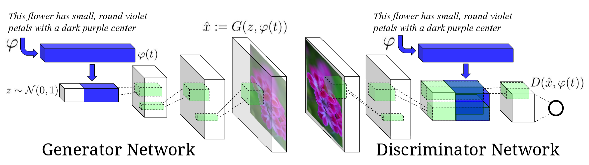
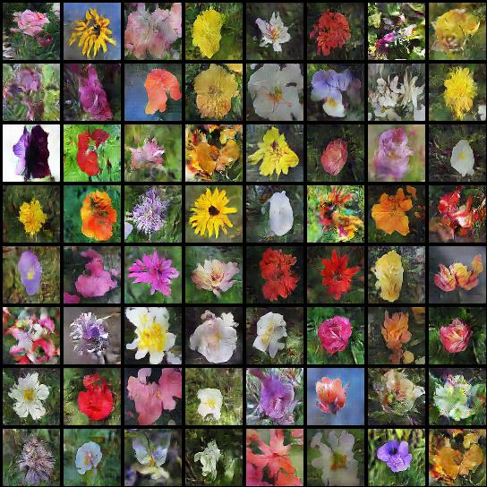

# Text-to-Image-Synthesis 

## Haard's notes

Link to forked repository [https://github.com/shahhaard47/Text-to-Image-Synthesis.git](https://github.com/shahhaard47/Text-to-Image-Synthesis.git)

### CV / NLP lit review

[Literature Review Doc](https://docs.google.com/document/d/1_SjmnQ7Fq7ZpDhTWY4iuUwRFNLT0LmQZtLzJgUalDPM/edit?usp=sharing)

Papers for
- CycleGAN for Text <--> Image
- CycleGAN for Images
- Image Captioning
- Attention

Text to image papers:
- [Image generation](https://github.com/watsonyanghx/Image-Text-Papers#image-generation-text----image)
- [Another collection](https://github.com/lzhbrian/arbitrary-text-to-image-papers#general-text-to-image)

### Training notes

- trained naive for 200 epochs (default params)
- then again for 400 epochs (with 1024 batch size)
```
python runtime.py --type naive --vis_screen naive --pre_trained_gen checkpoints/naive_gen_199.pth --batch_size 1024 --epochs 400
```
- trained regular "gan" for 200 epochs

### Data

- Download .hd5 files for birds or flowers dataset or convert yourself from original (as mentioned in [Datasets](#datasets) section)
- Also download text embeddings for [birds](https://drive.google.com/open?id=0B0ywwgffWnLLU0F3UHA3NzFTNEE) or [flowers](https://drive.google.com/open?id=0B0ywwgffWnLLZUt0UmQ1LU1oWlU) captions.

### Understanding inputs for the text-to-image models

> Checkout [understanding_inputs.pdf](understanding_inputs.pdf) or the notebook for images, captions, and embeddings shape and sample information.

Created this to understand how `txt2image_dataset.py` works.

### Implementation changes for Naive generator

> I just wanted to observe what kind of pictures a bunch of deconv layers stacked together could produce

- for any text-to-image work with code in this repo, use older versions I've put together in the `requirements.txt` file to install dependencies. Or prepare to port pytorch and visdom code, as well as train new text embeddings.

I used L1 loss to measure error between generated images (*fake images*) and real images. Following are highlights of changes I made to the code to do this:
- In `models/gan_factory.py`, simply added another conditional for `type=='naive'`. This returns the same Generator model as if you used type=='gan'.
- In `utils.py`, added a few duplicate functions for logging and saving checkpoint for a model without any discriminator loss values and weights.
- In `trainer.py`, modified `__init__` to not initialize a discriminator; added a `_train_naive` function to train a generator only model (adapted from current `_train_gan` but without a discriminator and a simple L1Loss); and added a conditional in `train()` to train the naive model.

### Loss functions 

For the **naive generator** (GAN without a discriminator), I used L1 loss because it was suggested [here](https://deepai.org/machine-learning-glossary-and-terms/per-pixel-loss-function)

For **GAN** (unmodified) following are the loss functions implemented:

For the discriminator, Binary Cross Entropy loss (`torch.nn.BCELoss`) is used.
- total discriminator loss, `d_loss` = `real_loss` + `fake_loss`, where
    - `real_loss` : predicting that real images are real
    - `fake_loss` : predicting that fake images (those produced by generator) are fake

For the generator, BCE, L1 (`torch.nn.L1Loss`) and L2 (`torch.nn.MSELoss`) losses are used. Here's how each loss is used to form overall generator loss (`g_loss`):
```python
g_loss = criterion(outputs, real_labels) \ # how well the generated images fooled the discriminator
+ self.l2_coef * l2_loss(activation_fake, activation_real.detach()) \ # how different the generated images se
+ self.l1_coef * l1_loss(fake_images, right_images)
```
Where,
1. measures how well the fake images (produced by generator) fooled the discriminator
2. measures difference in how fake images and real images are perceived by discriminator
3. measures how different fake images actually look from real images

NOTE: all images are conditioned on the input text (captions) for the corrsponding images.

> for more details about loss functions for GAN or WGAN look at the [linked paper](https://arxiv.org/abs/1605.05396) or the `_train_*()` functions in `trainer.py`. 

### Visdom notes

- Need to run visdom server
```bash
python -m visdom.server
```

Add to following to local `~/.ssh/config` to forward port from visdom server
```bash
LocalForward 127.0.0.1:8097 127.0.0.1:8097
```
Visdom's default port 8097
*make sure to restart terminal for changes to take effect*


## Intoduction

This is a pytorch implementation of [Generative Adversarial Text-to-Image Synthesis paper](https://arxiv.org/abs/1605.05396), we train a conditional generative adversarial network, conditioned on text descriptions, to generate images that correspond to the description. The network architecture is shown below (Image from [1]). This architecture is based on DCGAN.

<figure></figure>
Image credits [1]

## Requirements

- pytorch 
- visdom
- h5py
- PIL
- numpy

This implementation currently only support running with GPUs.

You can use `pip install -r requirements.txt` to minimize the time required to get code in this repository running.


## Implementation details

This implementation follows the Generative Adversarial Text-to-Image Synthesis paper [1], however it works more on training stablization and preventing mode collapses by implementing:
- Feature matching [2]
- One sided label smoothing [2]
- minibatch discrimination [2] (implemented but not used)
- WGAN [3]
- WGAN-GP [4] (implemented but not used)

## Datasets

We used [Caltech-UCSD Birds 200](http://www.vision.caltech.edu/visipedia/CUB-200.html) and [Flowers](http://www.robots.ox.ac.uk/~vgg/data/flowers/102/) datasets, we converted each dataset (images, text embeddings) to hd5 format. 

We used the [text embeddings](https://github.com/reedscot/icml2016) provided by the paper authors

**To use this code you can either:**

- Use the converted hd5 datasets,  [birds](https://drive.google.com/open?id=1mNhn6MYpBb-JwE86GC1kk0VJsYj-Pn5j), [flowers](https://drive.google.com/open?id=1EgnaTrlHGaqK5CCgHKLclZMT_AMSTyh8)
- Convert the data youself
  1. download the dataset as described [here](https://github.com/reedscot/cvpr2016)
  2. Add the paths to the dataset to `config.yaml` file.
  3. Use [convert_cub_to_hd5_script](convert_cub_to_hd5_script.py) or [convert_flowers_to_hd5_script](convert_flowers_to_hd5_script.py) script to convert the dataset.
  
**Hd5 file taxonomy**
`
 - split (train | valid | test )
    - example_name
      - 'name'
      - 'img'
      - 'embeddings'
      - 'class'
      - 'txt'
      
## Usage
### Training

`python runtime.py

**Arguments:**
- `type` : GAN archiecture to use `(gan | wgan | vanilla_gan | vanilla_wgan)`. default = `gan`. Vanilla mean not conditional
- `dataset`: Dataset to use `(birds | flowers)`. default = `flowers`
- `split` : An integer indicating which split to use `(0 : train | 1: valid | 2: test)`. default = `0`
- `lr` : The learning rate. default = `0.0002`
- `diter` :  Only for WGAN, number of iteration for discriminator for each iteration of the generator. default = `5`
- `vis_screen` : The visdom env name for visualization. default = `gan`
- `save_path` : Path for saving the models.
- `l1_coef` : L1 loss coefficient in the generator loss fucntion for gan and vanilla_gan. default=`50`
- `l2_coef` : Feature matching coefficient in the generator loss fucntion for gan and vanilla_gan. default=`100`
- `pre_trained_disc` : Discriminator pre-tranined model path used for intializing training.
- `pre_trained_gen` Generator pre-tranined model path used for intializing training.
- `batch_size`: Batch size. default= `64`
- `num_workers`: Number of dataloader workers used for fetching data. default = `8`
- `epochs` : Number of training epochs. default=`200`
- `cls`: Boolean flag to whether train with cls algorithms or not. default=`False`


## Results

### Generated Images

<p align='center'>

</p>

## Text to image synthesis
| Text        | Generated Images  |
| ------------- | -----:|
| A blood colored pistil collects together with a group of long yellow stamens around the outside        |   |
| The petals of the flower are narrow and extremely pointy, and consist of shades of yellow, blue      |   |
| This pale peach flower has a double row of long thin petals with a large brown center and coarse loo |  |
| The flower is pink with petals that are soft, and separately arranged around the stamens that has pi |  |
| A one petal flower that is white with a cluster of yellow anther filaments in the center |  |


## References
[1]  Generative Adversarial Text-to-Image Synthesis https://arxiv.org/abs/1605.05396

[2]  Improved Techniques for Training GANs https://arxiv.org/abs/1606.03498

[3]  Wasserstein GAN https://arxiv.org/abs/1701.07875

[4] Improved Training of Wasserstein GANs https://arxiv.org/pdf/1704.00028.pdf


## Other Implementations

1. https://github.com/reedscot/icml2016 (the authors version)
2. https://github.com/paarthneekhara/text-to-image (tensorflow)
